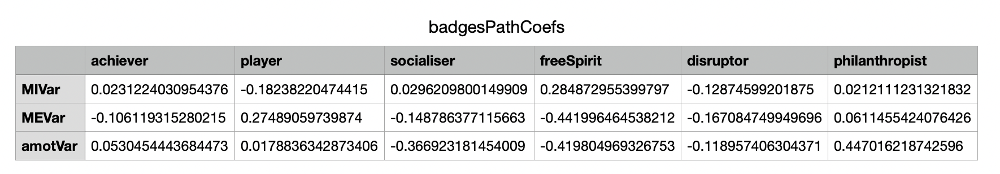
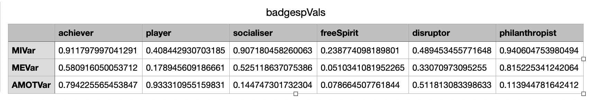

# gamification_adaptative

###Première partie :
#####Décrivez/commentez deux des matrices de résultats de l’analyse PLS. 
Nous avons choisi de décrire les matrices suivantes: 
- Path coefs de l’élément ludique badge pour le profil Hexad :

La matrice présente pour chaque catégorie hexad (Le Socialiser, Le Free Spirit, L’Achiever, Le Philanthropist, Le Disruptor, Le Player) les coefficients de variation de la motivation intrinsèque, la motivation extrinsèque et d'amotivation selon l'élément ludiques (badge dans ce cas).

- P val de l’élément ludique badge pour le profil Hexad :

On utilise la technique de p value pour valider ou rejeter des coefficients. Pour ce faire, cette matrice est associée à la matrice “path coef”, pour valider ou pas selon la p valeur max choisie (i p<0.05, voir p<0.1 en fonction de la précision souhaitée), le coefficient existant dans les mêmes cordonnées respectives. 
Par exemple, si on choisit p <0.1, on voit bien que la p valeur pour “freeSpirit”,”MEVar” est égale à 0.0510341081952265 qui est bien inférieur à 0.1. Ceci valide le path coef -0.441996464538212 pour “freeSpirit”,”MEVar”. 

#####Recommandations à partir des matrices PLS 

######Vecteur d'affinité pour profil Hexad 

######Vecteur d'affinité pour profil motivation 

###Deuxième partie :