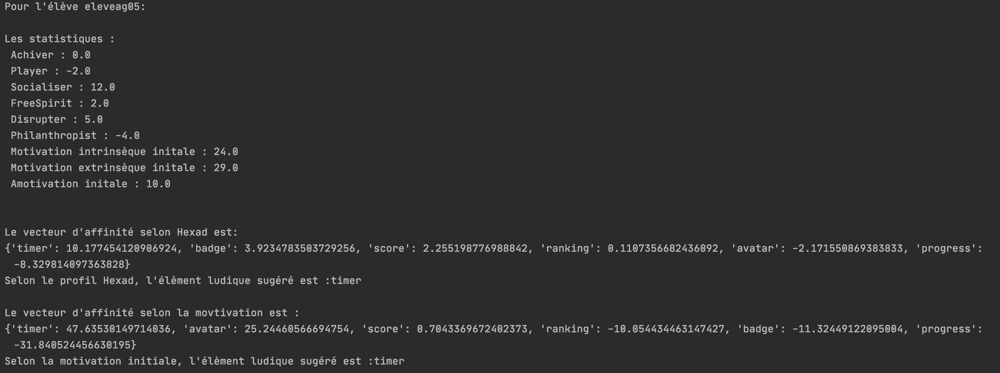

Étudiants : Emna Barred & Nabil Lamrabet.

# TP IHMxIA Gamification Adaptative

## Première partie

> Décrivez/commentez deux des matrices de résultats de l’analyse PLS. 

Nous avons choisi de décrire les matrices suivantes : 
- Path coefs de l’élément ludique badge pour le profil Hexad :


La matrice présente pour chaque catégorie Hexad (Le Socialiser, Le Free Spirit, L’Achiever, Le Philanthropist, Le Disruptor, Le Player) les coefficients de variation de la motivation intrinsèque, la motivation extrinsèque et d'amotivation selon l'élément ludiques (badge dans ce cas).


- P val de l’élément ludique badge pour le profil Hexad :


On utilise la technique de p value pour valider ou rejeter des coefficients. Pour ce faire, cette matrice est associée à la matrice "path coef", pour valider ou non selon la p valeur max choisie (i p<0.05, voir p<0.1 en fonction de la précision souhaitée), le coefficient existant dans les mêmes cordonnées respectives. 

Par exemple, si on choisit p <0.1, on voit bien que la p valeur pour "freeSpirit"/"MEVar" est égale à 0.0510 qui est bien inférieur à 0.1. Ceci valide le path coef -0.0441 pour "freeSpirit"/"MEVar". 


### Recommandations à partir des matrices PLS 

Nous avons créé la classe Student qui décrit l’élève, elle permet de calculer/récupérer ses statistiques à partir du fichier CSV `userStats.csv`. La méthode `printStatistics()` permet d’afficher pour l’élève en question ses statistiques. 

De multiples méthodes `get[nomDuParamVoulu]()` permettent de retourner la valeur du paramètre en question. Par exemple :
- `getArchiver()` retourne le coefficient de la catégorie Archiver pour cet élève récupéré du csv. 
- `getME()` récupère les valeurs de motivation extrinsèque initiales (meidI; meinI; mereI) les additionne et retourne la valeur de motivation extrinsèque initiale totale.


La méthode `getRandomStudent()` permet de récupérer des données d’un étudiant aléatoirement du CSV et de retourner une instance Student à partir de celles-ci.


la méthode `pathCoefsValidation()` reçoit en paramètre :
- pCoefs : La matrice des path coef d’un élément ludique donnée.
- pValues : La matrice p val équivalente.
- validateValue : La p valeur maximum.
- factor : Le type de profil (hexad ou motivation) pour savoir quel traitement faire selon le profil.

Cette méthode permet de vérifier si un coefficient dans la matrice pathCoef est pertinent (et donc à conserver) selon la valeur p val correspondante dans la matrice pval. Les coef qui ont un p val supérieur à validateValue seront mis à 0 et le nouveau pathcoef sera retourné par cette méthode.


Rappelons les définition suivantes :
- Motivation intrinsèque : l’action est conduite uniquement par l’intérêt et le plaisir que l’individu trouve à l’action, sans attente de récompense externe.

- Motivation extrinsèque : l’action est provoquée par une circonstance extérieure à l’individu (punition, récompense, pression sociale, obtention de l’approbation d’une personne tierce etc.).

Ces deux types de motivation sont complétés par un troisième état, l’amotivation :
- Amotivation : l’individu a le sentiment d’être soumis à des facteurs hors de tout contrôle. L’amotivation se distingue de la motivation extrinsèque par l’absence de motivation lié au sentiment de ne plus être capable de prévoir les conséquences de ses actions.

Donc pour calculer le score de motivation il faut additionner les valeurs de motivations intrinsèques et extrinsèque puis en soustraire la valeur de l’amotivation. 
Nous avons implémenté la méthode `gameElementScoreArray()` que nous utilisons pour trouver le vecteur de score de motivation contenant le score pour chaque élément. Ce vecteur sera utilisé par la suite pour générer le vecteur d’affinité avec la méthode `generateAffinityArray()`. Les méthodes se comportent de manières différentes selon le type de profil en question : 

### Vecteur de score et vecteur d'affinité pour profil Hexad 

Le vecteur du score du profil Hexad pour un Game Element spécifique, contient des valeurs de score pour chaque catégorie du profil Hexad. 
Pour trouver ces valeurs, on additionne les motivations intrinsèque et extrinsèque correspondantes à cette catégorie récupéréé du tableau pathcoefs validé (avec la méthode `pathCoefsValidation()`) de cet élément ludique et on en soustrait l’amotivation correspondante dans ce dernier. 
Par exemple: le score de la catégorie Achiever pour l'élément jeu “avatar” se calcule comme suit :

`score = pathCoefs["achiever"][0] + pathCoefs["achiever"][1] - pathCoefs["achiever"][2]`

Avec :

- `pathCoefs["achiever"][0]` correspond à la valeur de la motivation intrinsèque dans tableau avatarpathcoef pour "achiever"
- `pathCoefs["achiever"][1]` correspond à la valeur de la motivation extrinsèque dans tableau avatarpathcoef pour "achiever"
- `pathCoefs["achiever"][2]` correspond à la valeur de l’amotivation dans tableau avatarpathcoef pour "achiever"

Une fois ce vecteur est calculé, il est utilisé pour générer le vecteur d'affinité pour le profil Hexad. 
Pour ce faire, nous utilisons `generateAffinityArray()`, grâce à cette méthode, nous remplissons les clés d’un dictionnaire par les noms des éléments ludiques et leurs valeurs correspondantes. 
Ces valeurs sont calculées comme suit : la somme des multiplications du score de chaque catégorie du profil Hexad dans le vecteur des scores par sa valeur trouvé dans le CSV pour l’élève en question (identifié à partir d’un questionnaire). 

Par exemple : pour l'élément ludique "progress" le calcul est réalisé comme suit :

```
progress = student.getAchiver() * progressScoreArray[0] + 
    student.getPlayer() * progressScoreArray[1] +
    student.getSocialiser() * progressScoreArray[2] +
    student.getFreeSpirit() * progressScoreArray[3] +
    student.getDisruptor() * progressScoreArray[4] +
    student.getPhilanthropist() * progressScoreArray[5]
```

Dès qu'on finit de remplir le dictionnaire par tous les éléments ludiques et leurs valeurs, on le trie d'une façon décroissante. Le clé correspondant au premier élément est l'élément ludique suggéré selon le profil Hexad.

### Vecteur de score et vecteur d'affinité pour profil Hexad 

Le vecteur des scores pour le profil motivation est calculé de la même façon que le profil Hexad. 
La seule exception c’est qu’on cherche les scores pour les motivations intrinsèque, extrinsèque et l’amotivation.

`MI = pathCoefs["MI"][0] + pathCoefs["MI"][1] + pathCoefs["MI"][2] `

Encore une fois ce vecteur est utilisé pour générer le vecteur d’affinité mais cette fois-ci les valeurs sont calculés en suivant la règle : MI + ME - Amot.

Par exemple :

```
badge = student.getMI() * badgeScoreArray[0] + 
student.getME() * badgeScoreArray[1] - student.getAmot() * badgeScoreArray[2]
```

En rappelant que les valeur identifiées à partir du questionnaire AMS sont utilisés comme suit:
- student.getMI() additionne micoI, miacI et mistI pour trouver la motivation intrinsèque initial de l’étudiant
- student.getME() additionne meidI, meinI et mereI pour trouver la motivation extrinsèque initial de l’étudiant 
- student.getAmot() retourne l’amotivation initiale amotI


De la même façon, nous remplissons un dictionnaire qu’on trie par la suite pour trouver le Game Element suggéré par le profil motivation.



## Deuxième partie

### Étape 1 : exemples de cas à considérer

Nous avons généré tous les vecteurs Hexad et motivation initiale des élèves dans le fichier `vecteurs.txt` à la racine du projet. Nous avons ensuite sélectionné quelques cas intéressants. 

On rappelle que le premier élément des vecteurs est l'élément suggéré par le "modèle".

élève elevelg06 : 

```
hexad : {'timer', 'avatar', 'progress', 'score', 'badge', 'ranking'}

motivation initiale : {'timer', 'avatar', 'score', 'ranking', 'badge', 'progress'}
```
Les deux "modèles" sont d'accord pour dire que l'élément de jeu le plus adapté au joueur est timer.

élève elevebf14 : 

```
hexad : {'progress', 'avatar', 'ranking', 'badge', 'score', 'timer'}

motivation initiale : {'timer', 'avatar', 'score', 'ranking', 'badge', 'progress'}
```

Les deux "modèles" suggèrent des éléments différents (hexad : progress, motivation initiale : timer).

Pour hexad, 'timer' est le pire élément à suggérer, pour motivation initiale, 'progress' est le pire élément à suggérer.

En revanche les deux modèles suggèrent que l'élément 'avatar' n'est pas le meilleur, mais le deuxième meilleur.

Si on s'inspire de la théorie des jeux on a plutôt intérêt à suggérer 'avatar' dans ce genre de cas.

élève elevebf08 : 

```
hexad : {'avatar', 'progress', 'badge', 'timer', 'ranking', 'score'}

motivation initiale : {'timer', 'avatar', 'score', 'ranking', 'badge', 'progress'}
```

Dans ce cas là, visuellement on aurait tendance à suggérer 'avatar'.
Nous verrons par la suite l'algorithme choisi mais si on fait une moyenne des rangs on se rend
compte que 'avatar' a un rang moyen meilleur que 'timer'.

élève elevebg05 : 

```
hexad : {'score', 'progress', 'ranking', 'badge', 'avatar', 'timer'}

motivation initiale : {'timer', 'avatar', 'score', 'ranking', 'badge', 'progress'}
```

Il s'agit d'un autre cas similaire que le précédent qui est souvent présent dans le jeu de donnée et donc représentatif
de ce qu'on peut trouver.

élève elevebg11 : 

```
hexad : {'badge', 'avatar', 'timer', 'score', 'progress', 'ranking'}

motivation initiale : {'timer', 'avatar', 'score', 'ranking', 'badge', 'progress'}
```

Cas particulier, est-ce qu'on choisit 'timer', 'badge' ou 'avatar' ?

Si on considère qu'on veut départager le premier élément des deux vecteurs on choisit 'timer' mais 'timer' moins bien classé dans le modèle hexad
là où 'avatar' est plus équilibré. Il est assez compliqué de départager les deux, on considère que l'un ou l'autre sont satisfaisant.

### Étape 2 : stratégie et choix de l'algorithme

On décide d'implémenter un algorithme qui effectue, en quelques sortes, une moyenne des des deux vecteurs.

Nous n'allons pas implémenter exactement une moyenne mais on peut considérer comme tel.

Pour chaque élément d'un vecteur on lui attribue un poids, mieux l’élément est classé, plus le poids est élevé. Ainsi, dans un vecteur de 6 éléments, nous avons les poids suivants :

```
{'el 1': 6, 'el 2': 5, 'el 3': 4, 'el 4': 3, 'el 5': 2, 'el 6': 1}
```

On effectue ce traitement pour chaque vecteur. On stocke le résultat de ces traitements dans de nouveaux vecteurs qu'on additionne ensuite. Enfin on récupère le premier élément.

Voici un exemple avec le 2ème élève (elevebf14) cité précédemment :

Ses vecteurs sont :
```
hexad : {'progress', 'avatar', 'ranking', 'badge', 'score', 'timer'}

motivation_initiale : {'timer', 'avatar', 'score', 'ranking', 'badge', 'progress'}
```

On donne une pondération aux éléments selon le classement :

```
hexad_poids : {'progress': 6, 'avatar': 5, 'ranking': 4,
'badge': 3, 'score':2, 'timer': 1}

motivation_initiale_poids : {'timer': 6, 'avatar': 5, 
'score': 4, 'ranking': 3, 'badge': 2, 'progress'; 1}
```
On créé un nouveau vecteur en additionnant les nouveaux vecteurs (et le poids de chaque élément) :

```
vecteur_final : {'avatar': 10, 'progress': 7, 'timer': 7, 
'ranking': 4, 'score':6, 'badge': 5}
```

Le résultat obtenu correspond à ce que nous voulons : privilégier une valeur moins risquée ('avatar') mais tout de même performante (par rapport à 'progress' et 'timer' qui sont très performants dans un vecteur et très mauvais dans l'ordre, faire un choix entre les deux est risqué).

Cet algorithme simple se comporte comme attendu sur les cas que nous avons cités.

Pour le dernier cas très particulier, élève elevebg11 : 

```
hexad : {'badge', 'avatar', 'timer', 'score', 'progress', 'ranking'}

motivation initiale : {'timer', 'avatar', 'score', 'ranking', 'badge', 'progress'}
```

On doit prendre une décision entre 'badge', 'timer' et 'avatar'. Le plus important pour nous est d'éliminer 'badge' étant donné que le meilleur entre 'timer' et 'avatar' est discutable.


Avec notre algorithme, on obtient :

```
vecteur_final : {'avatar': 10, 'timer': 10, 'badge': 8, 
'score':7, 'ranking': 4, 'progress': 3}
```

Ensuite on peut choisir au hasard entre 'avatar' et 'timer' ion, à un certain point il faudra trier le vecteur par ordre décroissant.

On pourrait très bien avoir l'ordre suivant :

```
vecteur_final : {'timer': 10 ,'avatar': 10, 'badge': 8, 
'score':7, 'ranking': 4, 'progress': 3}
```

Si on veut être rigoureux il faudrait prendre les deux premiers et choisir au hasard nous allons nous contenter de prendre le premier élément de notre vecteur car ajouter une fonction aléatoire ne va pas améliorer les performances de l’algorithme.


Nous avons testé les éléments ludiques que notre algorithme a suggéré contre ceux réellement utilisés. Nous avons trouvé 43 échantillons adaptés et 215 échantillons non adaptés. Ceci peut être expliqué par le faite que nous nous trouvons des fois des éléments ludique de même poids et que notre algorithme se trouve dans l'obligation de donner un élément au hasard. Ainsi que, le vecteur d'affinité de motivation à toujours tendance à proposer 'timer' en premier ce qui fait que notre algorithme propose la plupart du temps 'timer' quand celui-ci se présente dans les top 3 de suggestions d'Hexad.

Enfin, et peut-être l'explication la plus importante vient dans le choix de notre algorithme. Peut-être qu'un compromis entre les deux modèles n'était absolument pas la bonne décision à prendre. Il aurait dans ce cas fallut choisir entre le meilleur élément de chaque vecteur.

Nous n'avons pas eu le temps de faire une analyste statistique plus poussée de nos résultats.